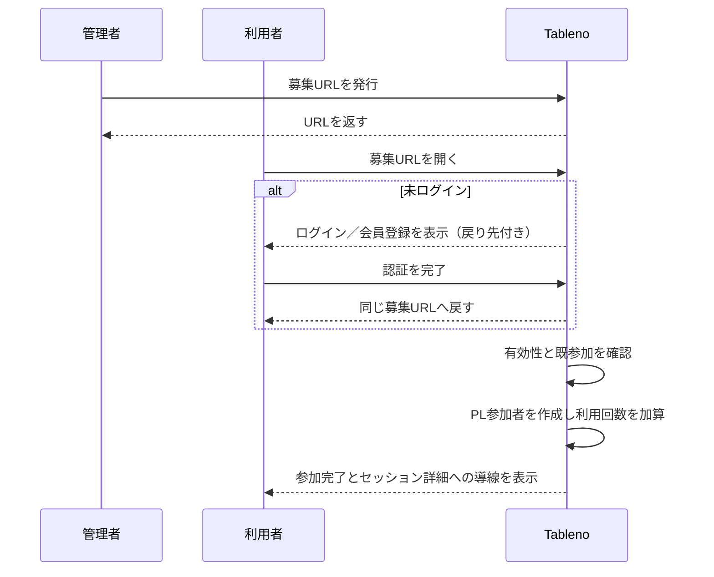

# セッション募集URL仕様書

最終更新: 2026-07-26
状態: 実装済み

## 1. 目的

セッション管理者が発行した募集URLを共有し、そのURLを開いてログインまたは会員登録を完了したユーザーを、当該セッションのPL参加者として登録する。

既存のゲスト招待は、未ログインの人が表示名を入力して仮参加者を作り、後から本人が引き取るための一回限りの招待である。本機能は、登録ユーザーを直接参加者にする複数利用可能な「募集」導線として別に扱う。

## 2. スコープ

### 含むもの

- セッションごとの募集URLの発行、一覧表示、コピー、失効
- URLの有効期限と利用上限
- 未ログイン者をログイン／会員登録へ遷移させ、完了後に同じ募集URLへ戻す導線
- ログイン完了後の自動PL参加登録
- 既に参加済みのユーザーを重複登録しない冪等な処理
- 募集URLの公開ページ、結果表示、監査情報

### 含まないもの

- 仮参加者・グループ仮メンバーのclaim
- 参加申請をGMが承認するワークフロー
- 参加枠・シナリオの推奨人数による自動定員判定（現状の `TRPGSession` に参加定員を保持する項目はない）
- 募集URL経由でのGM／共同GM権限の付与、キャラクター選択、グループ加入

## 3. 用語

| 用語 | 意味 |
| --- | --- |
| 募集URL | トークンを含む、複数の登録ユーザーをPLとして参加させられるURL |
| 利用 | 未参加ユーザーを参加者として新規登録すること。既参加ユーザーの再アクセスは利用回数に数えない。 |
| 有効 | 失効しておらず、有効期限内で、利用回数が上限未満である状態 |

## 4. 権限

- 発行・一覧・失効は `can_manage_participants(user, session)` が真のユーザーだけが行える。
- 募集URLを使うユーザーはログイン必須とする。
- URL経由で作成する `SessionParticipant` のロールは常に `player` とする。
- セッションがグループに紐づく場合でも、募集URLの利用者をグループへ自動加入させない。

## 5. 利用フロー



### 5.1 募集URLの公開ページ

- URL: `GET /session-recruitment/<token>/`
- 有効なURLでは、セッションタイトル、GM表示名、開催日時（未定なら「日程未定」）、募集URLの有効期限を表示する。
- URLが不正、失効、期限切れ、または上限到達の場合は、セッション情報を表示せず、状態だけを表示する。
- 未ログイン時はログインと会員登録ボタンを表示する。両方の `next` は当該募集URLの相対パスに限定する。
- 認証から戻ったログイン済みユーザーは、自動送信するCSRF付き `POST` により参加登録する。状態変更を `GET` で行ってはならない。
- 登録済みユーザーは参加処理を行わず、「すでに参加しています」とセッション詳細へのリンクを表示する。

### 5.2 参加登録

1. サーバーはトークンのハッシュで募集URLを検索する。
2. トランザクション内で募集URL行をロックし、有効状態を再確認する。
3. `(session, user)` の参加者が既にあれば、成功（HTTP 200）として終了する。この場合 `use_count` は増やさない。
4. 未参加なら `session_permissions.create_participant()` で `user=request.user`、ロール `player` の `SessionParticipant` を作成する。
5. `use_count` を 1 増やし、参加記録を保存する。
6. 成功後、セッション詳細画面へ遷移できる完了画面を返す。

同時アクセスでは、行ロックと既存の `SessionParticipant(session, user)` の一意制約により、上限超過・二重登録を防ぐ。競合して既存参加者が確認できた場合は成功として扱う。

## 6. データモデル

`schedules.SessionRecruitmentLink` を追加する。

| フィールド | 型・制約 | 説明 |
| --- | --- | --- |
| `session` | FK `TRPGSession` | 対象セッション。削除時は連鎖削除。 |
| `created_by` | FK `CustomUser` | 発行者。 |
| `token_digest` | `CharField(64)`, unique, index | 生トークンの SHA-256。生トークンは保存しない。 |
| `expires_at` | `DateTimeField`, index | 有効期限。 |
| `max_uses` | `PositiveIntegerField` | 利用上限。1〜1,000。 |
| `use_count` | `PositiveIntegerField`, default 0 | 新規参加登録の回数。 |
| `revoked_at` | nullable `DateTimeField` | 失効日時。 |
| `created_at` | `DateTimeField` | 発行日時。 |

`is_active` は `revoked_at is None`、`expires_at > now`、`use_count < max_uses` のすべてを満たす場合に真とする。

初期値は `expires_in_hours=168`（7日）、`max_uses=1` とする。作成時に各値はそれぞれ 1〜720 時間、1〜1,000 回へ制限する。

参加監査が必要なため、`SessionRecruitmentLinkUse` も追加する。

| フィールド | 説明 |
| --- | --- |
| `recruitment_link` | 募集URLへの FK（削除不可） |
| `participant` | 作成された `SessionParticipant` への FK（削除不可） |
| `joined_by` | 参加した `CustomUser` への FK（削除不可） |
| `joined_at` | 参加日時 |

`(recruitment_link, joined_by)` を一意にする。既に参加済みだったため登録を省略したアクセスは監査レコードを作らない。

## 7. API

### 7.1 発行

`POST /api/sessions/<session_id>/recruitment-links/`

リクエスト例:

```json
{
  "expires_in_hours": 168,
  "max_uses": 4
}
```

成功時は `201 Created`。レスポンスには `id`、`recruitment_url`、`expires_at`、`max_uses`、`use_count`、`is_active` を含める。生トークンはこの発行レスポンスと公開URLにだけ含め、以後の管理APIでは返さない。

### 7.2 一覧

`GET /api/sessions/<session_id>/recruitment-links/`

管理者だけが利用できる。各URLの `id`、期限、上限、利用数、失効日時、有効状態、発行日時を返す。

### 7.3 失効

`DELETE /api/sessions/<session_id>/recruitment-links/<link_id>/`

管理者だけが利用できる。`revoked_at` を設定して `204 No Content` を返す。利用済み参加者は削除しない。

### 7.4 参加確定

`POST /api/session-recruitment/<token>/join/`

ログイン必須、CSRF保護対象。ボディは不要。成功時は以下を返す。

```json
{
  "participant_id": 123,
  "session_id": 45,
  "already_joined": false
}
```

既参加時は `200 OK` と `already_joined: true`、新規参加時は `201 Created` とする。不正トークンは `404`、無効URLは `410 Gone`、認証なしはログイン画面へ誘導するWeb画面ではなくAPIとしては `401` を返す。

## 8. UI要件

- セッション詳細の参加者管理領域に「募集URLを発行」ボタンを追加する。
- 発行モーダルでは有効期限（時間）と利用上限を設定でき、発行後はURLのコピー操作を提供する。
- 同領域に有効なURLと失効済みURLの一覧を表示し、残り利用回数・期限・失効操作を提供する。
- 公開ページには、URLを知る第三者に秘匿HO、GMメモ、非公開参加者情報、メールアドレス、内部IDを表示しない。
- 参加完了後、参加者管理画面では通常のPL参加者として表示する。

## 9. 受入基準・テスト

1. 参加者管理権限を持つユーザーは募集URLを発行でき、権限のないユーザーは `403` となる。
2. 未ログインでURLを開くと、認証後に同じURLへ戻り、ログインユーザーがPLとして1件だけ作成される。
3. 同じユーザーが再度URLを開いても参加者は増えず、`use_count` も増えない。
4. 異なるユーザーは `max_uses` に達するまで参加でき、到達後は `410` となる。
5. 期限切れ・失効・不正トークンでは参加者を作成せず、セッション詳細を公開しない。
6. 同時に最後の枠を使おうとした場合、成功は1人だけであり、`use_count <= max_uses` を満たす。
7. URL経由の参加者には `player` ロールだけが付与され、GM・管理権限・グループメンバーシップは増えない。
8. 既存の `GuestInvitation` の発行、ゲスト参加、claim のテストが引き続き通る。

## 10. 実装上の補足

- トークン生成・ハッシュ化・失効判定は `accounts.GroupInviteLink` と `schedules.GuestInvitation` の既存方式に揃える。
- 参加者作成は直接モデル作成せず、既存の `session_permissions.create_participant()` を利用する。
- 認証後の戻り先は、ログイン・会員登録・OAuthすべてで引き継げることを結合テストで確認する。現行の会員登録実装が `next` を使わない場合は、この機能の実装に含めて修正する。
- 公開URLはログ・エラーメッセージ・管理一覧に生トークンを残さない。

## 11. 実装

2026-07-26 に以下を実装した。

- モデル・監査: `schedules.SessionRecruitmentLink`、`schedules.SessionRecruitmentLinkUse`
- マイグレーション: `schedules/migrations/0054_sessionrecruitmentlink_sessionrecruitmentlinkuse_and_more.py`
- 参加処理: `schedules/recruitment.py`
- 発行・一覧・失効・参加API、公開ページ: `schedules/recruitment_views.py`
- 管理UI: `templates/schedules/session_detail.html`
- 公開UI: `templates/schedules/session_recruitment.html`
- 認証後の安全な復帰: `accounts/auth_redirects.py` とログイン・会員登録・allauthアダプター
- 受入・権限・秘匿・冪等性・利用上限・認証復帰・UIテスト: `schedules/test_recruitment_links.py`

同一利用者の再送は、利用上限到達後も参加済みとして冪等に成功させる。新規参加の利用枠は、行ロックに加えて条件付き更新とデータベース制約で確保し、`use_count <= max_uses` を維持する。
